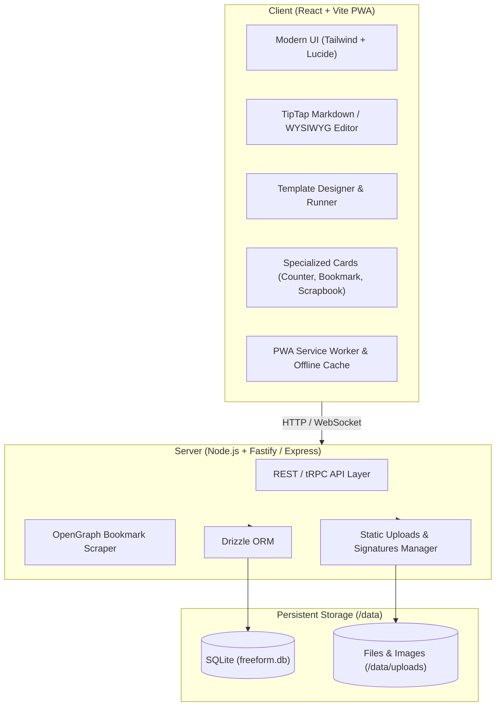

# Implementation Plan: 'Free Form' Note & Form System

## Goal Description
Build **Free Form**, a modern, lightweight, self-hostable, open-source note-taking platform and PWA designed around two central pillars:
1. **Fluid Multi-Modal Notes**: Markdown-native notes (with WYSIWYG and raw source toggle), interactive counters, webpage bookmark cards, and image scrapbook posters organized in hierarchical notebooks.
2. **"Free Form" Structured Templates (The Core Gimmick)**: A visual template builder allowing users to design reusable structured form pages (text inputs, numeric steppers, tables, dropdowns, ratings, checkboxes, signature pads, etc.) that can be rapidly filled out and saved into notebooks either as structured entries or clean Markdown documents.

The app will be packaged as a lightweight Docker container with a single data volume, SQLite database, and PWA capabilities for installability on mobile and desktop.

---

## System Architecture



---

## User Review Required

> [!IMPORTANT]
> **Key Architectural Decisions for User Alignment**:
> 1. **Data Model & Backend Technology**:
>    - **Recommendation**: Node.js + TypeScript (Fastify) with SQLite (via Drizzle ORM).
>    - **Why**: Allows sharing TypeScript validation schemas (Zod) between frontend and backend, ultra-lightweight Docker footprint (~70MB Alpine), single-file database (`freeform.db`) with zero maintenance or external DB requirements.
> 2. **Form Storage & Markdown Portability**:
>    - When a form template is filled out, how should it be stored?
>    - **Proposed Dual Approach**: The note stores both the structured JSON data (so it can be re-edited inside the custom form UI anytime) AND generates a clean, readable Markdown representation with frontmatter metadata. This ensures that even if you export your notes to Obsidian, Joplin, or raw files, all your form entries are 100% human-readable.
> 3. **Authentication Strategy**:
>    - Starting with configurable Single-User mode (password or PIN protected, or public for local LAN) with an optional multi-user setup down the line.

---

## Open Questions

> [!NOTE]
> Please review these design points and let us know your preferences:
> 1. **Default View for Notebooks**: When opening a notebook, do you prefer a grid of cards (Notion/Google Keep style), a traditional two-pane list + editor view (Apple Notes / Bear style), or a toggleable layout?
>     * `Toggle between both would be great. Default as card view`
> 2. **Template-Driven Notebooks**: Would you like the option to lock a notebook to a specific template (e.g. a "Car Maintenance" notebook where hitting "+" immediately opens the Car Maintenance form)?
>     * `Yes please`
> 3. **Rich Text / Markdown Editor Choice**: We propose **TipTap** (ProseMirror-powered) which allows rich WYSIWYG editing, raw Markdown mode toggle, and custom interactive widgets embedded inside the note. Does that match your expectation?
>     * `That sounds perfect. Idk anything about tiptap or any other options, so ill trust you on this `

---

## Proposed Project Structure

We propose a clean monorepo or unified fullstack layout in `/home/codaine/Projects/free-form`:

```
free-form/
├── docker/
│   ├── Dockerfile
│   └── docker-compose.yml
├── server/
│   ├── src/
│   │   ├── db/              # Drizzle ORM schema & migrations (SQLite)
│   │   ├── routes/          # API routes (notes, notebooks, templates, bookmarks, files)
│   │   ├── services/        # Bookmark scraper, markdown generator, image processor
│   │   └── index.ts         # Fastify server entry point
│   ├── package.json
│   └── tsconfig.json
├── client/
│   ├── src/
│   │   ├── components/
│   │   │   ├── editor/      # TipTap WYSIWYG + Markdown source toggle
│   │   │   ├── forms/       # Template builder & form filler (signature pad, tables, inputs)
│   │   │   ├── items/       # Counters, Bookmark cards, Scrapbook poster grid
│   │   │   ├── layout/      # Sidebar, notebook tree, topbar, mobile nav
│   │   │   └── ui/          # Reusable UI primitives (buttons, modals, dialogs)
│   │   ├── hooks/           # Data fetching (TanStack Query) & local state
│   │   ├── types/           # Shared Zod schemas and TypeScript types
│   │   ├── App.tsx
│   │   └── main.tsx
│   ├── public/              # Icons, manifest.webmanifest for PWA
│   ├── vite.config.ts       # Vite + PWA configuration
│   └── package.json
├── package.json             # Root workspace config
├── README.md
└── LICENSE                  # MIT FOSS
```

---

## Detailed Feature Specifications

### 1. The Core Item Types ("More Than Just Notes")
Every item in Free Form lives inside a **Notebook** (or in an inbox / uncategorized pool) and can be tagged and searched:
- **Markdown Notes**: Rich text WYSIWYG with headers, checklists, code blocks, tables, images, and a toggle to switch directly to raw Markdown code view.
- **Counters**:
  - Name, current count, step size (+1, +5, etc.), reset value.
  - Quick +/- tap buttons directly from notebook card view.
  - History log (timestamped log of adjustments).
- **Webpage Bookmarks**:
  - URL input with automatic background metadata scraping (page title, description, favicon, OpenGraph cover image).
  - Notes / tags attached to the bookmark.
- **Scrapbook / Posters**:
  - Image-focused cards with photo gallery preview, caption, zoom modal, and scrapbook-style collage view.

### 2. The Signature Gimmick: "Free Form" Template System
- **Template Designer**:
  - Drag-and-drop or reorderable field builder.
  - Supported Field Components:
    - **Header / Section Title / Description Label**
    - **Text Input** (Single line or multi-line)
    - **Number Stepper / Input** (with min, max, unit e.g. `$`, `kg`, `miles`)
    - **Checkbox / Toggle Switch**
    - **Dropdown / Single Select & Multi-Select Tags**
    - **Interactive Rating** (Stars / scale 1-5 / 1-10)
    - **Date & Time Picker**
    - **Dynamic Table Grid** (define columns, user can add rows)
    - **Signature Box** (HTML5 touch/mouse canvas with clear & save as PNG/SVG)
    - **Photo / File Attachment**
- **Filling & Saving**:
  - Users can click "New from Template" -> select template -> fill fields.
  - Instant auto-save to the selected notebook.
  - Pre-fill defaults and quick-entry shortcuts.
  - Stored as dual JSON schema + Markdown table rendering.

---

## Phased Implementation Roadmap

### Phase 1: Project Scaffolding & Core Architecture
- [ ] Initialize monorepo with Node.js, TypeScript, Vite, Fastify, and Tailwind CSS.
- [ ] Set up SQLite with Drizzle ORM and automatic database migrations.
- [ ] Configure Docker multi-stage build (`Dockerfile`) and `docker-compose.yml`.
- [ ] Establish base API response structures and client router.

### Phase 2: Notebooks & Markdown Editor Foundation
- [ ] Build Notebook hierarchy (folders, nested notebooks, color coding, icons).
- [ ] Integrate TipTap editor with:
  - Rich text formatting (bold, italic, headers, bullet lists, task checklists, code blocks).
  - Split / toggle view for raw Markdown editing.
  - Image drag-and-drop into notes.
- [ ] Global search across notes, titles, and tags.

### Phase 3: Multi-Modal Item Modules
- [ ] **Counters**: Implement interactive counter cards with quick-tap increment/decrement and history.
- [ ] **Bookmarks**: Backend OpenGraph metadata scraper and rich link cards.
- [ ] **Scrapbook / Posters**: Multi-image upload, thumbnail grid, and lightbox view.

### Phase 4: The "Free Form" Template Engine
- [ ] Build Template Schema Builder UI (add, configure, reorder fields).
- [ ] Implement Form Runner UI (interactive form input, signature canvas, dynamic tables).
- [ ] Dual-format serialization (JSON schema instance + rendered Markdown representation).
- [ ] Template presets (e.g. Daily Standup, Vehicle Log, Habit Review, Expense Quick-Log).

### Phase 5: PWA, Offline Readiness & Mobile Polish
- [ ] Configure `vite-plugin-pwa` with web manifest, mobile splash icons, and service worker caching.
- [ ] Touch-friendly mobile bottom navigation and swipe interactions.
- [ ] Backup & Export system (Export all notebooks as ZIP containing Markdown + attachments + JSON).

---

## Verification Plan

### Automated Tests
- Server unit and integration tests using Vitest:
  - Database CRUD operations for notebooks, notes, items, and templates.
  - Form schema validation tests (ensuring submitted form instances adhere to template definitions).
  - OpenGraph link scraper tests.
- Client tests:
  - Component tests for TipTap editor and Signature Canvas.

### Manual Verification
- **Docker Validation**: Run `docker compose up --build` and verify cold-start container initialization, persistent volume mount, and single-port access.
- **PWA Installation**: Test PWA install prompt in Chromium / Firefox and mobile simulation.
- **Form Flow Test**: Create a template with text, number, table, and signature -> fill out an entry -> save to notebook -> verify both visual form inspection and exported Markdown format.
- **Multi-Modal Cards**: Test counter increments, bookmark thumbnail fetching, and scrapbook image uploading.
